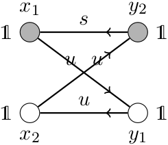
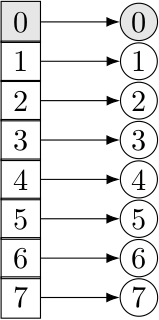
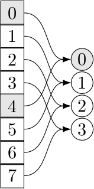
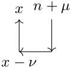

# TikZ Graphics

There are a bunch of common illustrations that we need every now and then
(gauge links, clover term, ...). Here are TikZ pictures that can be used by
others.

The graphics here are licensed under [CC-BY
4.0](https://creativecommons.org/licenses/by/4.0/) which means that you can use
and modify them as long as you attribute to the original author. But that's
required by academic practice anyway, so a simple reference to the name is
fine and this repository is fine.

The files here must be minimal LaTeX files that compile (perhaps we use
Travis CI at some point). Also the files contain the name of the author and
another reference to the license.

# Images

## Four dimensional lattice

[4d-lattice.tex](4d-lattice.tex)

## Clover Term

## Corr Box

## Cubic Group Conjugacy Classes

## Dilution Schemes

## Gauge Links

## HYP Smearing

## Leap Frog

## Parallelpiped

## Plaquette

## QPhiX SoA Length

## Staples

## Nested Time Scales

